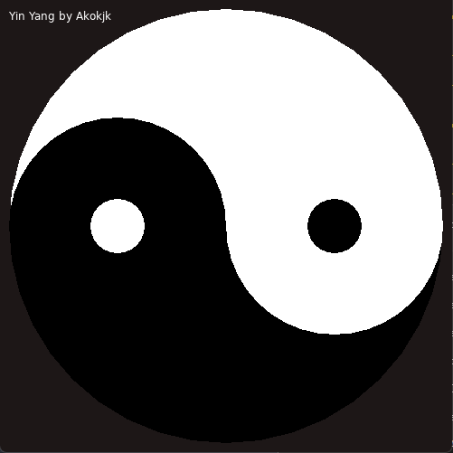

This is a little yin yang not much else to say.

Fun things to try:

1. Use trig to rotate the yin yang
 - There is two ways to do this I can think of 1 easy, 1 hard
2. Create patterns of repeating yin yang

Preview:

